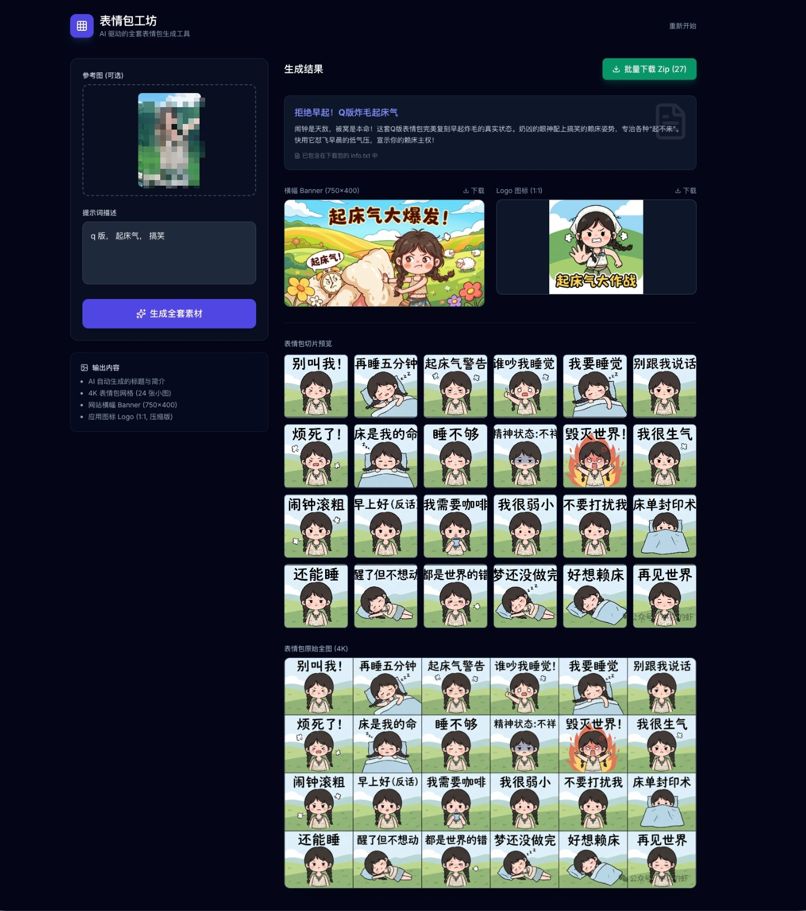

# 表情包工坊 (Meme Workshop)

AI 驱动的全套表情包生成工具，一键生成表情包、Banner、Logo 和文案。



## 功能特性

- **表情包生成**: 使用 Gemini Pro 生成 4K 表情包网格 (24 张小图)
- **Banner 横幅**: 自动生成 750x400 尺寸的网站横幅
- **Logo 图标**: 生成 512x512 压缩版应用图标
- **智能文案**: AI 自动生成标题与简介
- **参考图支持**: 可上传参考图片指导生成风格
- **批量下载**: 一键打包下载所有素材 (ZIP 格式)

## 技术栈

- **前端框架**: React 19 + TypeScript
- **构建工具**: Vite 6
- **AI 服务**: Google Gemini API (@google/genai)
- **图标库**: Lucide React
- **文件处理**: JSZip + FileSaver

## 本地运行

**前置条件**: Node.js 18+

1. 安装依赖:
   ```bash
   npm install
   ```

2. 配置环境变量，在 `.env.local` 文件中设置 Gemini API Key:
   ```
   GEMINI_API_KEY=your_api_key_here
   ```

3. 启动开发服务器:
   ```bash
   npm run dev
   ```

## 构建部署

```bash
# 构建生产版本
npm run build

# 本地预览生产版本
npm run preview
```

## 项目结构

```
├── App.tsx              # 主应用组件
├── index.tsx            # 应用入口
├── types.ts             # TypeScript 类型定义
├── components/
│   └── Icons.tsx        # 图标组件
├── services/
│   ├── geminiService.ts # Gemini API 服务
│   └── imageUtils.ts    # 图片处理工具
└── vite.config.ts       # Vite 配置
```

## 使用说明

1. (可选) 上传参考图片，指定人物或风格
2. 输入提示词描述想要的表情包内容
3. 点击「生成全套素材」按钮
4. 等待 AI 生成完成后，可预览或批量下载所有素材
